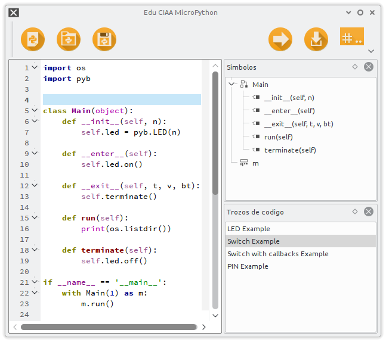
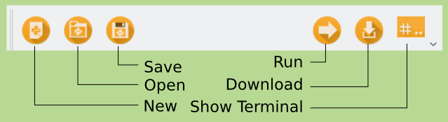
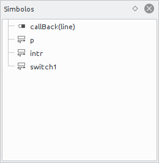
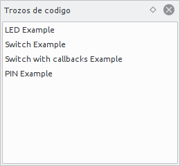
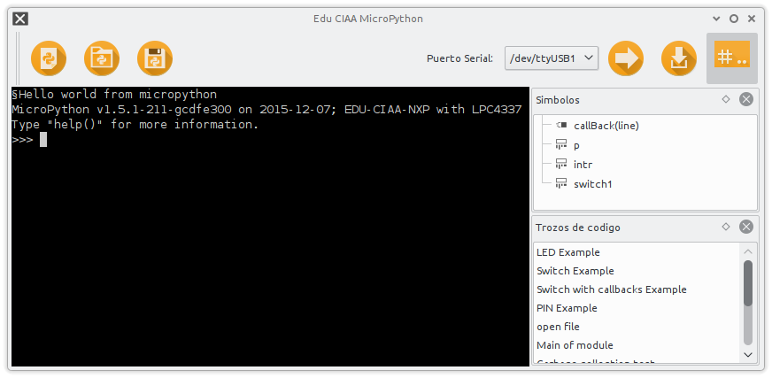

# uPython IDE

This is the IDE for micropython on EDU-CIAA.

#### Requeriments

 - Python 3.X
 - PyQt or PySide
 - PyQode
 - PySerial
 - PyTE
 - tendo

#### Requeriment instalation
```bash
pip install pyside pyqode.python pyserial pyte tendo
```

Replace pip by pip3 or command of your distribution.

### Characteristics

  - Syntax higlight
  - Autocomplete
  - Online help
  - Parameter lints
  - PEP8 code style lints
  - Simbol browser
  - Code Snipplets
  - Embedded serial terminal

### Usage

This is the main window


#### Tool Bar


Actions:
  - **New**: Clear context of editor
  - **Open**: Open file on editor
  - **Save**: Save current editor context.
  - **Run**: Execute script directly into board
  - **Download**: Save script into board
  - **Show Terminal**: Switch to terminal view

#### Side Views

###### Symbol bar
This view allows quick access to the symbols in the code on editor



###### Snipplets
This view show some code snipplets to speed edition



#### Terminal


